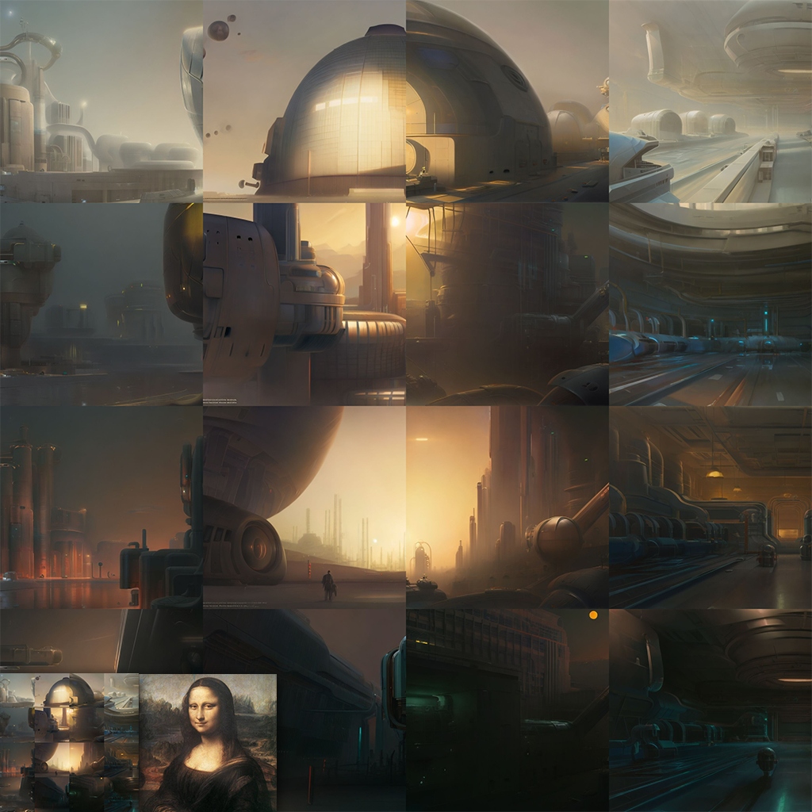
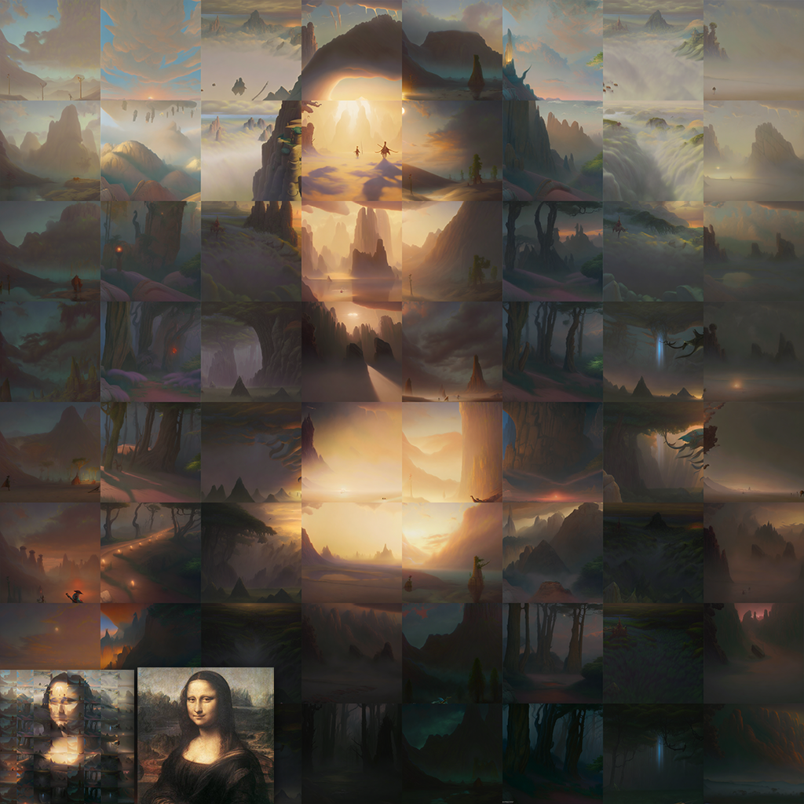
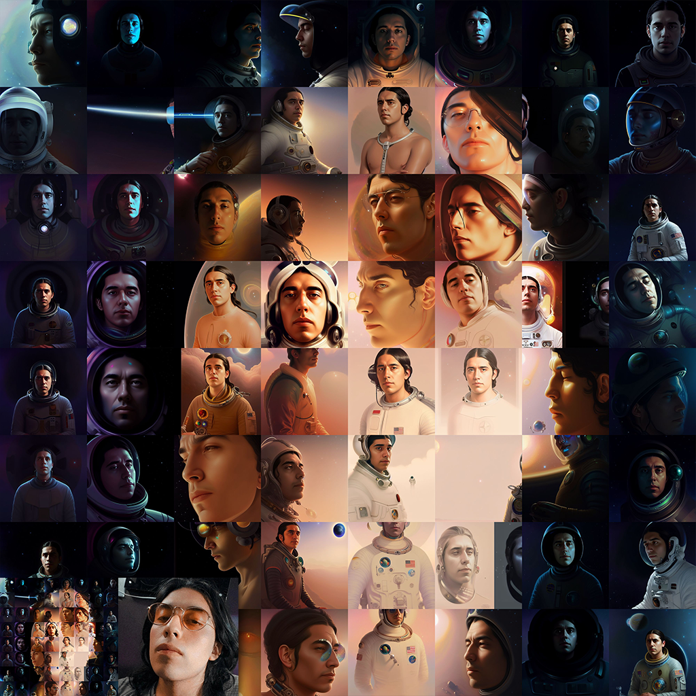
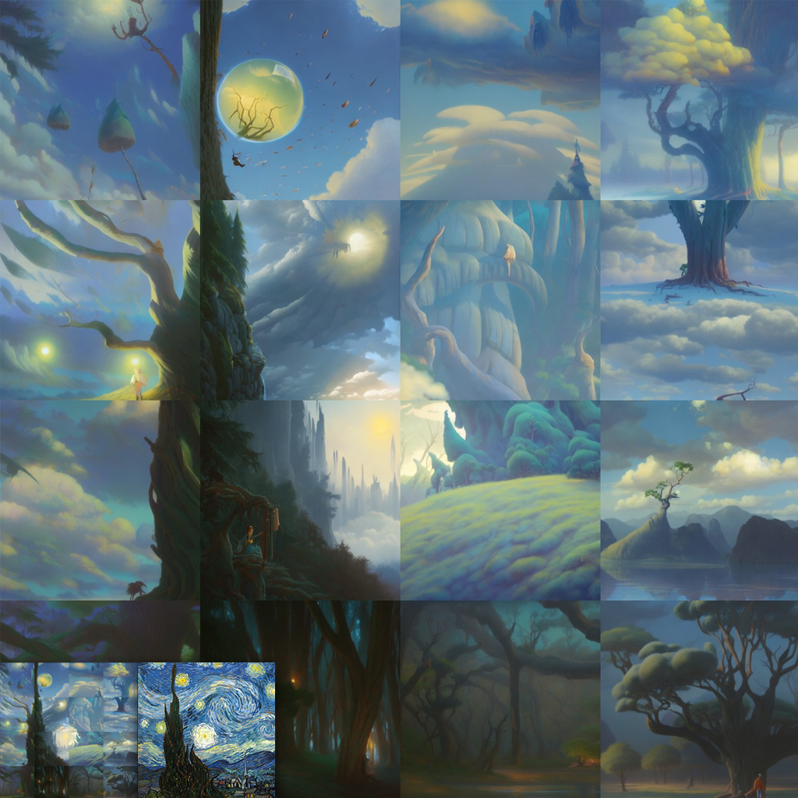
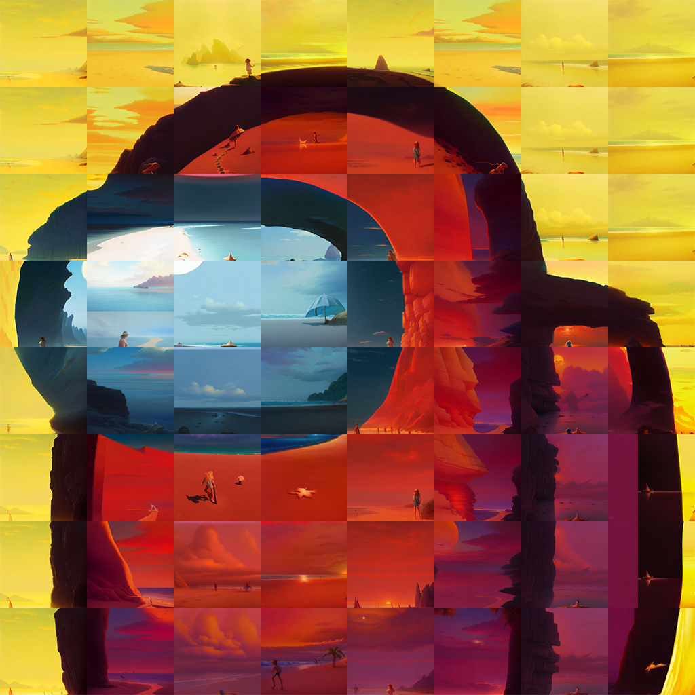

  # img2tiles
  ### Simple AUTOMATIC1111 UI script to generate tiles from a base image
  #### ⚠ WIP PRs welcome 😄

  ## Installation
  Place img2tiles.py into /YOUR_SD_FOLDER/scripts

  ## Usage
  - Go to img2img and load your base image (for now, only tested on 1:1 512x512 images)
  - Choose **img2tiles** from the scripts select
  - Adjust tile size (128 makes a 4x4 grid)
  - Adjust overlap
  - Choose your model and inference settings

  ## Tips
  - Pictures with highly recognizable patterns gives the best results
  - Low steps count with high denoising strength (>0.8) on a sampling like Euler_a, Euler and DDIM outputs great results
  - You can use any model you want, even Dreambooth ones
  - You can erase tile divisions with inpainting (fun fact: Runway inpainting model doesn't work that great)

  ## Examples
  #### Mona Lisa 4x4
  

  ### Mona Lisa 8x8
  

  ### Selfie with a Dreambooth model of the same person as the original picture
  

  ### Van Gogh
  

  ### SUS
  

  ## Credits
  Based on **sd_upscale.py**